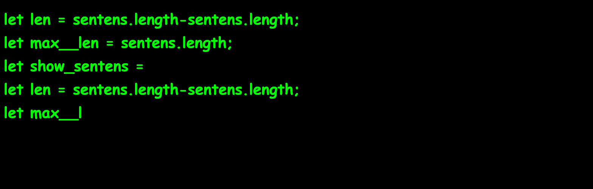

# HackerTyper (Javascript)
It looks like haker's display.  
But,you don't have to know words.  
You should do only type keybord!!  

# DEMO

# Features
 Fun! Fun! Fun!

# Usage
Type! Type! Type!

# Author
* <a href = "https://github.com/tomato645">Github</a>
* <a href = "https://twitter.com/tomato645P">Twitter</a>
* <a href = "https://qiita.com/tomato645">Qiita</a>

# License
"HackerTyper" is under [MIT license](https://en.wikipedia.org/wiki/MIT_License).
